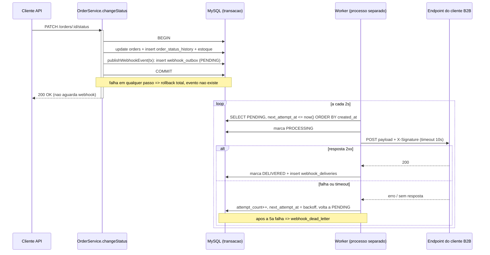
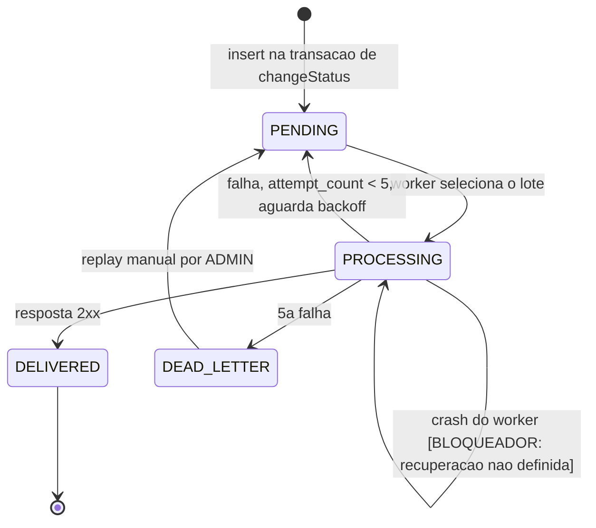

### FDD: Sistema de Webhooks de Notificação de Pedidos

Versão: 1.0
Data: 2026-07-15
Responsável: Larissa (Tech Lead), conforme `[09:50]`: "Eu vou abrir o doc de design da feature e marcar uma sessão pro Bruno e o Diego revisarem comigo antes da gente começar a codar."
Revisores técnicos: Bruno (Engenheiro Pleno, time de Pedidos), Diego (Engenheiro Sênior, time de Plataforma), Sofia (Engenheira de Segurança, revisão obrigatória de 2 dias úteis antes do deploy, `[09:46]`)
Documentos relacionados: [RFC](./RFC.md), [ADR-001](./adrs/ADR-001-padrao-outbox-no-mysql.md), [ADR-002](./adrs/ADR-002-worker-em-processo-separado-com-polling.md), [ADR-003](./adrs/ADR-003-retry-com-backoff-exponencial-e-dlq.md), [ADR-004](./adrs/ADR-004-autenticacao-hmac-sha256-por-endpoint.md), [ADR-005](./adrs/ADR-005-garantia-at-least-once-com-x-event-id.md)

> **Convenção de rastreabilidade deste documento**
> `[hh:mm]` referencia a transcrição da reunião (`TRANSCRICAO.md`). Caminhos como `src/...` referenciam código existente e verificado.
> **[BLOQUEADOR]** marca ponto que a reunião não decidiu e que impede implementar o trecho afetado. Não há valor default proposto: cada um exige decisão humana antes do código correspondente. A lista consolidada está na seção 9.

---

### 1. Contexto e motivação técnica

O OMS não possui hoje nenhum mecanismo de notificação externa, eventos ou filas. Três clientes B2B (Atlas Comercial, MaxDistribuição e Nova Cargo) fazem polling contra `GET /orders` para detectar mudanças de status, o que torna a integração lenta e cara do lado deles `[09:00]`. A Atlas sinalizou risco de churn caso não haja entrega até o fim do trimestre `[09:00]`.

**O problema técnico concreto.** O método `changeStatus()` em `src/modules/orders/order.service.ts:126` executa hoje, dentro de um único `this.prisma.$transaction`, quatro operações acopladas: validação da transição via `canTransition()`, débito ou reposição de estoque (`debitStock` / `replenishStock`), `tx.order.update` e `tx.orderStatusHistory.create`. Introduzir uma chamada HTTP nesse bloco significaria que um cliente lento segura a transação e bloqueia mudanças de status de outros pedidos, e que a indisponibilidade de um terceiro forçaria rollback de uma operação de negócio legítima `[09:04]`. A feature precisa registrar o evento com a mesma atomicidade da transação, mas entregá-lo fora dela.

**Encaixe na arquitetura existente.** A solução adota o padrão Outbox no MySQL já operacional, sem nova infraestrutura `[09:07]`. O módulo `src/modules/webhooks` segue o mesmo formato dos demais (`schemas`, `repository`, `service`, `controller`, `routes`) `[09:27]`, e um processo separado `src/worker.ts` espelha `src/server.ts` `[09:11]`. O detalhamento de cada ponto de contato está na seção 11.

**Atores.**

| Ator | Papel |
| --- | --- |
| `OrderService.changeStatus()` | Produtor do evento, dentro da transação existente |
| Worker de webhooks (`src/worker.ts`) | Consumidor da outbox, responsável pelo envio HTTP e pelo ciclo de retry |
| Endpoint do cliente B2B | Receptor externo, valida a assinatura HMAC e deduplica por `X-Event-Id` |
| Usuário autenticado (JWT) | Configura endpoints de webhook via CRUD |
| Usuário ADMIN | Único autorizado a executar replay da DLQ `[09:36]` |

**Limites.** Escopo estritamente outbound: a plataforma envia, os clientes recebem; não há webhooks de entrada `[09:02]`. A feature não altera a máquina de estados nem as regras de estoque; apenas acrescenta uma operação à transação existente.

**Suposições e restrições explícitas.**

- Restrição: se a inserção na outbox falhar, a transação inteira sofre rollback. Não pode existir caso de status mudar e evento não sair `[09:40]`.
- Restrição: latência abaixo de 10 segundos entre a mudança de status e a notificação `[09:02]`.
- Restrição: o worker roda como processo separado da API. O mesmo processo não é aceitável `[09:11]`.
- Restrição: a revisão de segurança da Sofia é gate obrigatório antes do deploy, não negociável sob pressão de prazo `[09:46]`.
- Suposição: o `PrismaClient` do worker é uma instância nova apontando para a mesma `DATABASE_URL`, por ser outro processo Node `[09:30]`.

---

### 2. Objetivos técnicos

| Objetivo | Medida ou invariante verificável |
| --- | --- |
| Consistência atômica entre mudança de status e registro do evento | Nenhum evento existe na `webhook_outbox` sem commit da transação de status, e nenhuma transação commitada de status subscrito deixa de gerar evento. Verificável por teste de rollback forçado. |
| Latência de notificação dentro do contrato | Tempo entre commit e primeiro POST ao cliente abaixo de 10 segundos, com alvo de até 2 segundos pelo intervalo de polling `[09:09]`, `[09:02]`. |
| Desacoplamento da disponibilidade do cliente | Falha, lentidão ou indisponibilidade do endpoint externo não afeta a latência nem o resultado de `changeStatus()`. Verificável com endpoint que responde em 30s: a mudança de status permanece dentro do tempo atual. |
| Idempotência determinística no cliente | O `event_id` é gerado uma única vez, na inserção da outbox, e é imutável em todas as retentativas `[09:25]`. Duas tentativas do mesmo evento carregam sempre o mesmo `X-Event-Id`. |
| Autenticidade e integridade verificáveis | 100% dos requests saem assinados com HMAC-SHA256 usando a secret vigente do endpoint `[09:22]`. |
| Isolamento de blast radius de secret | O vazamento da secret de um endpoint não permite forjar assinatura válida para nenhum outro endpoint `[09:21]`. |
| Fidelidade temporal do payload | O payload reflete o estado do pedido no instante da transição, não no instante do envio (snapshot na inserção, `[09:52]`). |
| Nenhuma nova dependência de infraestrutura | A feature sobe usando MySQL, Prisma e Node já existentes. HMAC usa `node:crypto` (nativo). Zero pacotes novos em `package.json` além de scripts. |

---

### 3. Escopo e exclusões

**Incluído**

- Tabelas `webhook_endpoints`, `webhook_outbox`, `webhook_deliveries` e `webhook_dead_letter` via migração Prisma.
- Função `publishWebhookEvent(tx, order, fromStatus, toStatus)` chamada de dentro da transação de `changeStatus()` `[09:41]`.
- Filtragem por status subscrito no momento da inserção: se nenhum endpoint do customer escuta aquele status, a linha não é criada `[09:34]`.
- Snapshot do payload renderizado na inserção `[09:52]`.
- Entry-point `src/worker.ts` e script `npm run worker`, com loop de polling de 2 segundos `[09:11]`, `[09:09]`.
- Assinatura HMAC-SHA256 por endpoint, com rotação e grace period de 24h `[09:22]`.
- Retry com backoff exponencial 1m/5m/30m/2h/12h, 5 tentativas, timeout de 10s por chamada `[09:17]`, `[09:42]`.
- DLQ em tabela separada e endpoint de replay manual restrito a ADMIN `[09:18]`, `[09:36]`.
- CRUD de configuração de webhook e histórico de entregas `[09:31]`, `[09:33]`, `[09:34]`.
- Validação de TLS obrigatório e limite de 64KB de payload `[09:23]`, `[09:24]`.

**Excluído**

- Notificação por email ao cliente com webhook falhando. Fora de escopo desta fase, possível próxima fase após medir o impacto `[09:37]`.
- Dashboard visual para o cliente. Projeto separado do time de frontend `[09:40]`.
- Rate limiting de saída. Decisão adiada: "a gente observa e implementa se virar problema" `[09:39]`.
- Webhooks de entrada (inbound). Fora do escopo declarado `[09:02]`.
- Escala horizontal do worker (múltiplas instâncias em paralelo). Explicitamente adiado como "problema do futuro" `[09:13]`.
- Arquivamento ou purge de eventos entregues. Citado como "depois de 30 dias ou assim", mas declarado fora do escopo desta feature `[09:08]`.
- Endurecimento de RBAC no CRUD de configuração. Adiado: "Por enquanto sim. Mais pra frente a gente pode endurecer" `[09:37]`.
- Detalhes do pedido no payload (`items`). Payload enxuto por decisão; o cliente busca em `GET /orders/:id` se precisar `[09:43]`.

---

### 4. Fluxos detalhados e diagramas

**Fluxo principal (produção do evento, dentro da transação)**

1. Cliente HTTP chama `PATCH /api/v1/orders/:id/status`, tratado por `OrderController.changeStatus`.
2. `OrderService.changeStatus()` abre `this.prisma.$transaction`.
3. Validações existentes rodam sem alteração: `findUnique`, checagem `from === to`, `canTransition(from, to)`.
4. Estoque é debitado ou reposto conforme `shouldDebitStock` / `shouldReplenishStock`.
5. `tx.order.update` grava o novo status.
6. `tx.orderStatusHistory.create` grava a auditoria existente.
7. **Novo passo:** `publishWebhookEvent(tx, order, from, to)` é chamado com o mesmo `tx`.
   1. Consulta `webhook_endpoints` ativos do `customerId` cujo array de eventos subscritos contém `to`.
   2. Se o resultado for vazio, retorna sem inserir nada (filtragem na inserção, `[09:34]`).
   3. Para cada endpoint encontrado, renderiza o payload (snapshot) e insere uma linha em `webhook_outbox` com `status = PENDING`, `event_id` (UUID), `attempt_count = 0` e `next_attempt_at = now()`.
8. Transação commita. Se qualquer passo falhar, incluindo o passo 7, tudo sofre rollback e nenhum evento existe `[09:40]`.
9. A resposta HTTP ao chamador não aguarda nenhuma entrega de webhook.

**Fluxo principal (consumo do evento, no worker)**

1. `src/worker.ts` sobe, instancia `PrismaClient` próprio e entra em loop.
2. A cada 2 segundos, busca em batch os eventos com `status = PENDING` e `next_attempt_at <= now()`, ordenados por `created_at` ascendente `[09:08]`, `[09:09]`.
3. Marca o lote como `PROCESSING`.
4. Para cada evento: carrega o endpoint, calcula `X-Signature` com HMAC-SHA256 do corpo usando a secret vigente, monta os headers e faz POST com timeout de 10 segundos `[09:42]`.
5. Resposta 2xx: marca o evento como `DELIVERED` e grava linha em `webhook_deliveries` com status, corpo da resposta e tempo de resposta `[09:34]`.
6. Encerra e aguarda o próximo tick.

**Fluxos alternativos e exceções**

- **Falha de entrega (não 2xx, timeout, erro de rede):** grava a tentativa em `webhook_deliveries`, incrementa `attempt_count`, calcula `next_attempt_at` pela tabela de backoff e devolve o evento a `PENDING`.
- **Esgotamento das 5 tentativas:** move o evento para `webhook_dead_letter` com payload, motivo da falha e timestamp `[09:18]`, e remove ou marca como terminal na outbox.
- **Replay manual:** ADMIN chama `POST /admin/webhooks/dead-letter/:id/replay`; o evento retorna à outbox como `PENDING` `[09:18]`, e a ação é registrada com identidade do executor para auditoria `[09:36]`.
- **Payload acima de 64KB:** o evento não é enviado e é tratado como erro, não truncado `[09:23]`, `[09:24]`.
- **Nenhum endpoint subscrito ao status:** nenhum evento é criado. Não é erro, é o caminho esperado.
- **Rotação de secret dentro do grace period de 24h:** o worker assina com a secret vigente; a anterior permanece válida do lado do cliente até expirar `[09:21]`.
- **Shutdown (SIGINT/SIGTERM):** o worker trata os sinais espelhando `src/server.ts:13-21`, que encerra o processo e chama `prisma.$disconnect()` sem reconciliar estado. **[BLOQUEADOR]** Se o shutdown gracioso deve, além disso, devolver eventos `PROCESSING` em andamento a `PENDING` antes de encerrar não foi decidido na reunião. Ver ADR-002.
- **[BLOQUEADOR] Shutdown não gracioso (SIGKILL) ou crash:** o comportamento de recuperação de eventos travados em `PROCESSING` não foi decidido na reunião. Sem essa definição, o worker não pode ser considerado seguro para produção, pois eventos ficam órfãos indefinidamente. Ver ADR-002 e ADR-003.

**Diagrama de sequência (fluxo principal)**



**Diagrama de estados do evento na outbox**



---

### 5. Contratos públicos (assinaturas, endpoints, headers, exemplos)

Base path `/api/v1`, conforme `src/app.ts`. Todos os endpoints de configuração exigem JWT válido via `authenticate` (`src/middlewares/auth.middleware.ts:27`). O `customerId` vem do body ou do path e **não** do JWT, porque o JWT atual representa o usuário operador, não o cliente `[09:32]`.

#### Contrato 1: `publishWebhookEvent`

- Tipo: function
- Assinatura: `publishWebhookEvent(tx: Prisma.TransactionClient, order: Order, fromStatus: OrderStatus | null, toStatus: OrderStatus): Promise<void>`
- Semântica: função pura que recebe o `tx` da transação em andamento, sem injetar repository inteiro no `OrderService` `[09:41]`. Lança exceção em caso de falha de insert, propagando o rollback da transação chamadora.

#### Contrato 2: cadastrar endpoint de webhook

- Tipo: http_endpoint
- Rota: `POST /api/v1/webhooks`
- Autorização: JWT autenticado, qualquer role `[09:37]`
- Semântica de status: `201` criado; `400` `WEBHOOK_INVALID_URL` para URL não https; `422` `VALIDATION_ERROR` para body inválido; `401` sem token.

**Exemplo de requisição**

```json
{
  "customerId": "6f1c2b0e-2f4a-4d3e-9c1b-8a7d5e2f1a90",
  "url": "https://webhooks.atlascomercial.com.br/oms/orders",
  "events": ["SHIPPED", "DELIVERED"],
  "active": true
}
```

**Exemplo de resposta**

```json
{
  "id": "b3f7c1a2-9d84-4c6f-a1e5-3b2d8c7f4e01",
  "customerId": "6f1c2b0e-2f4a-4d3e-9c1b-8a7d5e2f1a90",
  "url": "https://webhooks.atlascomercial.com.br/oms/orders",
  "events": ["SHIPPED", "DELIVERED"],
  "active": true,
  "secret": "whsec_R2xvYmFsU2VjcmV0RXhlbXBsb05hb1JlYWw",
  "createdAt": "2026-07-15T13:20:41.882Z"
}
```

> A secret é gerada pela plataforma e devolvida na criação `[09:31]`.
> **[BLOQUEADOR]** Comprimento mínimo e fonte de entropia da secret não definidos. **[BLOQUEADOR]** Política de exposição pós-criação (entrega única ou recuperável via GET) não definida. Ambos são itens da revisão da Sofia. Ver ADR-004.

#### Contrato 3: listar, editar e remover

- Tipo: http_endpoint
- Rotas: `GET /api/v1/webhooks?customerId=<uuid>`, `PATCH /api/v1/webhooks/:id`, `DELETE /api/v1/webhooks/:id` `[09:33]`
- Semântica de status: `200` sucesso; `204` no DELETE; `404` `WEBHOOK_NOT_FOUND`.
- Nota: o campo `secret` nunca é retornado em listagem.

**Exemplo de requisição (PATCH)**

```json
{
  "events": ["PAID", "SHIPPED", "DELIVERED"],
  "active": false
}
```

#### Contrato 4: rotacionar secret

- Tipo: http_endpoint
- Rota: `POST /api/v1/webhooks/:id/rotate-secret`
- Semântica: gera nova secret vigente e mantém a anterior válida por 24h `[09:21]`.

**Exemplo de resposta**

```json
{
  "id": "b3f7c1a2-9d84-4c6f-a1e5-3b2d8c7f4e01",
  "secret": "whsec_Tm92YVNlY3JldEV4ZW1wbG9OYW9SZWFs",
  "previousSecretExpiresAt": "2026-07-16T13:25:10.114Z"
}
```

#### Contrato 5: histórico de entregas

- Tipo: http_endpoint
- Rota: `GET /api/v1/webhooks/:id/deliveries`
- Semântica: retorna as últimas entregas com sucesso ou falha, payload, resposta e tempo de resposta `[09:34]`.

**Exemplo de resposta**

```json
{
  "data": [
    {
      "id": "0d9a4c11-7e63-4b58-9f21-6c3a5e8d2b74",
      "eventId": "1f8b6d2a-4c93-4e17-8a5f-2d7c9b1e3a06",
      "eventType": "order.status_changed",
      "attempt": 2,
      "success": true,
      "responseStatus": 200,
      "responseBody": "{\"received\":true}",
      "durationMs": 187,
      "sentAt": "2026-07-15T13:31:02.554Z"
    }
  ]
}
```

#### Contrato 6: replay de DLQ (ADMIN)

- Tipo: http_endpoint
- Rota: `POST /api/v1/admin/webhooks/dead-letter/:id/replay` `[09:35]`
- Autorização: `authenticate` + `requireRole('ADMIN')`, reusando `src/middlewares/auth.middleware.ts:49` `[09:36]`
- Semântica de status: `202` recolocado na outbox como `PENDING`; `403` `FORBIDDEN` para não ADMIN; `404` `WEBHOOK_NOT_FOUND`.
- Auditoria: registra quem executou o replay `[09:36]`.

**Exemplo de resposta**

```json
{
  "id": "7c2e9a05-3b81-4f6d-b0a4-9e1f8d3c5b27",
  "eventId": "1f8b6d2a-4c93-4e17-8a5f-2d7c9b1e3a06",
  "status": "PENDING",
  "replayedBy": "a91d4e77-0c62-4b39-8f15-2e6a7d9c4b83",
  "replayedAt": "2026-07-15T14:02:19.310Z"
}
```

> **[BLOQUEADOR]** Semântica do `attempt_count` após replay (reinicia em zero ou mantém o acumulado) não definida. Ver ADR-003.

#### Contrato 7: evento entregue ao cliente B2B (contrato de saída)

- Tipo: http_endpoint (outbound)
- Rota: URL cadastrada pelo cliente, obrigatoriamente `https` `[09:23]`
- Método: `POST`

**Semântica de headers** `[09:44]`, `[09:45]`

| Header | Significado |
| --- | --- |
| `X-Event-Id` | UUID do evento, gerado na inserção da outbox e imutável entre tentativas. Chave de deduplicação do lado do cliente `[09:25]`. |
| `X-Signature` | HMAC-SHA256 do corpo do request, calculado com a secret do endpoint `[09:20]`. |
| `X-Timestamp` | Timestamp do envio, para o cliente detectar replay attack se quiser `[09:44]`. |
| `X-Webhook-Id` | UUID do endpoint cadastrado, para clientes com múltiplos cadastros identificarem qual caiu naquele envio `[09:44]`. |
| `Content-Type` | `application/json` `[09:44]`. |

**Exemplo de requisição (enviada pela plataforma)**

```json
{
  "event_id": "1f8b6d2a-4c93-4e17-8a5f-2d7c9b1e3a06",
  "event_type": "order.status_changed",
  "timestamp": "2026-07-15T13:31:02.367Z",
  "order_id": "4a7e1c93-6b25-4d8f-9a03-1e5c7b2d9f48",
  "order_number": "ORD-2026-000871",
  "from_status": "PROCESSING",
  "to_status": "SHIPPED",
  "customer_id": "6f1c2b0e-2f4a-4d3e-9c1b-8a7d5e2f1a90",
  "total_cents": 148900
}
```

> Campos derivados de `[09:43]`: `event_id`, `event_type`, `timestamp` ISO 8601, `order_id`, `order_number`, `from_status`, `to_status`, `customer_id` e campos básicos como `total_cents`. `items` não é enviado para não inflar o payload; o cliente busca em `GET /orders/:id` se precisar `[09:43]`.
> O `event_id` é exposto tanto no corpo do payload `[09:43]` quanto no header `X-Event-Id` `[09:44]`, atendendo a clientes que dedupam pelo header e a clientes que processam apenas o corpo. Ver ADR-005.

**Exemplo de resposta esperada do cliente**

```json
{ "received": true }
```

Qualquer 2xx é sucesso. Corpo da resposta é gravado em `webhook_deliveries` mas não é interpretado.

**Limites e versionamento**

| Aspecto | Valor | Origem |
| --- | --- | --- |
| Timeout por chamada | 10 segundos | `[09:42]` |
| Tamanho máximo do payload | 64KB, com erro acima do teto (não trunca) | `[09:23]`, `[09:24]` |
| Rate limit de saída | Não implementado nesta fase | `[09:39]` |
| Latência alvo | Abaixo de 10s, com polling de 2s | `[09:02]`, `[09:09]` |
| Versionamento | Rotas sob `/api/v1`, seguindo o padrão de `src/app.ts`. O formato do payload e a semântica at-least-once tornam-se contrato público: migrar para exactly-once seria breaking change `[09:26]`. |

---

### 6. Erros, exceções e fallback

**Matriz de erros previstos**

Todos os erros do módulo estendem `AppError` (`src/shared/errors/app-error.ts`) e usam prefixo `WEBHOOK_` `[09:29]`. O `errorMiddleware` (`src/middlewares/error.middleware.ts:14`) já formata qualquer `AppError` em `{ error: { code, message, details } }` sem precisar de alteração `[09:29]`.

| Condição | Código | HTTP | Classe base | Tratamento | Origem |
| --- | --- | --- | --- | --- | --- |
| Endpoint de webhook inexistente | `WEBHOOK_NOT_FOUND` | 404 | `NotFoundError` | Retorna erro ao chamador | `[09:28]` |
| URL cadastrada não é https | `WEBHOOK_INVALID_URL` | 400 | `BadRequestError` | Rejeita no schema Zod, antes de persistir | `[09:23]`, `[09:28]` |
| Secret ausente onde é obrigatória | `WEBHOOK_SECRET_REQUIRED` | 400 | `BadRequestError` | Rejeita na validação | `[09:28]` |
| Payload do evento acima de 64KB | `WEBHOOK_PAYLOAD_TOO_LARGE` | 422 | `UnprocessableEntityError` | Não envia e não trunca. "Se chegou nesse tamanho, tem algo errado" | `[09:23]`, `[09:24]` |
| Replay solicitado por não ADMIN | `FORBIDDEN` | 403 | `ForbiddenError` (existente) | Barrado por `requireRole('ADMIN')` antes do controller | `[09:36]` |
| Item de DLQ inexistente no replay | `WEBHOOK_NOT_FOUND` | 404 | `NotFoundError` | Retorna erro ao ADMIN | `[09:35]` |
| Lista de eventos com status inválido | `VALIDATION_ERROR` | 400 | `ZodError` (já tratado) | `errorMiddleware:26` formata as issues | `[09:29]` |

> Os quatro primeiros códigos derivam da convenção fechada em `[09:28]`: "Códigos tipo `WEBHOOK_NOT_FOUND`, `WEBHOOK_INVALID_URL`, `WEBHOOK_SECRET_REQUIRED`, etc." Os demais aplicam a mesma convenção a regras decididas na reunião.
> **[BLOQUEADOR]** O comportamento para cliente que usa a secret anterior após expirar o grace period de 24h não foi definido, incluindo se há erro explícito (`WEBHOOK_SECRET_EXPIRED`) ou falha silenciosa. Ver ADR-004.

**Falhas de entrega (não geram erro HTTP na API, alimentam o ciclo de retry)**

| Condição no worker | Tratamento |
| --- | --- |
| Resposta não 2xx | Grava tentativa, incrementa `attempt_count`, agenda `next_attempt_at`, volta a `PENDING` |
| Timeout acima de 10s | Tratado como falha e marcado para retry `[09:42]` |
| Erro de rede ou DNS | Idem acima |
| 5ª falha consecutiva | Move para `webhook_dead_letter` com payload, motivo e timestamp `[09:18]` |

**Estratégias de resiliência**

- **Timeouts:** 10 segundos por chamada HTTP `[09:42]`.
- **Retries:** 5 tentativas, decididas contra as 3 propostas por Bruno, porque 3 não cobrem indisponibilidade real de 2h em manutenção planejada `[09:16]`.
- **Backoff exponencial:** 1m, 5m, 30m, 2h, 12h, cobrindo cerca de 15 horas entre a primeira e a última tentativa `[09:17]`. Validado pelo negócio: "Se um cliente meu cair por 15 horas, ele já tá com problema sério dele" `[09:17]`.
- **Circuit breaker:** não discutido na reunião e não incluído nesta fase. O efeito prático de isolamento vem do backoff, que espaça as tentativas por endpoint.
- **Isolamento de processo:** a falha do worker não afeta a API e vice-versa `[09:11]`.

**Política de fallback**

Não existe canal alternativo de entrega. O email como fallback foi explicitamente adiado para a próxima fase `[09:37]`. O fallback efetivo é a DLQ: o evento é preservado com contexto de falha e depende de replay manual por ADMIN `[09:18]`. Isso é decisão consciente, não lacuna.

**Invariantes críticos**

1. Um evento existe na `webhook_outbox` se, e somente se, a transação de `changeStatus` commitou `[09:06]`.
2. O `event_id` é gerado na inserção e nunca é regenerado em retentativa `[09:25]`. Quebrar esse contrato inutiliza silenciosamente a deduplicação do cliente, sem erro explícito.
3. O payload é snapshot do instante da transição e não é recalculado no envio `[09:52]`.
4. Enquanto houver um único worker, os eventos de um mesmo `order_id` são entregues na ordem de `created_at` `[09:12]`. Não há garantia de ordenação global, e os clientes não a requisitaram `[09:14]`.
5. Nenhuma secret aparece em log, em qualquer nível.

---

### 7. Observabilidade

> **Base real verificada no código.** O projeto já tem logging estruturado, mas **não tem métricas, tracing, alertas nem APM**. A busca por `prometheus`, `opentelemetry`, `otel`, `metric`, `statsd`, `datadog` e `sentry` em `src/` e `package.json` não retorna nada, e não existe rota `/metrics`. As subseções abaixo separam o que estende padrão existente do que exige decisão nova.

**O que já existe e será reutilizado**

| Recurso | Localização | Como a feature usa |
| --- | --- | --- |
| Logger Pino estruturado JSON | `src/shared/logger/index.ts:13` | O worker importa o mesmo `logger`. Nenhuma lib nova `[09:29]`. |
| `base: { service, env }` | `src/shared/logger/index.ts:20` | O worker sobrescreve `service` para distinguir da API nos logs agregados. |
| Redação de campos sensíveis | `src/shared/logger/index.ts:4-11` | Estender `redactPaths` com os campos de secret de webhook, atendendo ao invariante 5 e ao caso real de secret vazada em log `[09:22]`. |
| `LOG_LEVEL` por ambiente | `src/config/env.ts:6` | O worker respeita a mesma variável. |
| Correlação por `X-Request-Id` | `src/middlewares/request-logger.middleware.ts:6-8` | Os endpoints CRUD de webhook herdam o middleware automaticamente. |
| Log de acesso `http_request` com `durationMs` | `src/middlewares/request-logger.middleware.ts:14-24` | Aplica-se sem alteração aos endpoints do módulo. |
| Endpoint `/health` | `src/app.ts:62` | O worker expõe verificação de liveness espelhando esse padrão. |

**Logs**

Formato: JSON estruturado via Pino, timestamp ISO (`pino.stdTimeFunctions.isoTime`), seguindo exatamente o padrão de `request-logger.middleware.ts`, que loga um objeto de campos mais uma mensagem curta de evento.

Campos essenciais nos logs do worker, por tentativa de entrega:

- `eventId`: correlaciona todas as tentativas do mesmo evento, requisito explícito do ADR-005.
- `webhookId`, `customerId`, `orderId`, `orderNumber`
- `fromStatus`, `toStatus`
- `attempt` e `maxAttempts`
- `responseStatus`, `durationMs` (mesmo nome já usado em `request-logger.middleware.ts:20`)
- `outcome`: `delivered`, `retry_scheduled` ou `dead_lettered`
- `nextAttemptAt` quando houver retry
- `error` com a causa em caso de falha

Eventos de log nomeados, seguindo a convenção `http_request` já existente: `webhook_delivery_attempt`, `webhook_delivery_succeeded`, `webhook_delivery_failed`, `webhook_dead_lettered`, `webhook_replayed` (este último obrigatoriamente com a identidade do executor, requisito de auditoria da Sofia `[09:36]`), `webhook_worker_started`, `webhook_worker_stopped`.

Proteção de dados sensíveis: a secret nunca entra em log, nem em campo de erro. O `X-Signature` calculado também não deve ser logado, por permitir inferência. Isso exige estender `redactPaths` em `src/shared/logger/index.ts:4`.

Cardinalidade: `eventId`, `orderId` e `customerId` são alta cardinalidade e servem para busca e correlação em log, não como dimensão de métrica.

**Métricas**

**[BLOQUEADOR]** O projeto não possui nenhuma instrumentação de métricas, e a reunião não discutiu o assunto em nenhum momento. Definir a stack (Prometheus com endpoint `/metrics`, push para gateway externo, ou outra), o conjunto de métricas e as metas exige decisão de arquitetura e de infraestrutura que não tem origem na transcrição nem no código. Sem isso, os critérios de aceite de observabilidade da seção 9 não são verificáveis automaticamente.

Grandezas que a operação da feature torna necessário observar, para servir de pauta a essa decisão: latência entre commit e entrega, profundidade da outbox (eventos `PENDING`), taxa de sucesso por endpoint, distribuição de `attempt_count`, volume de entradas na DLQ e idade do evento mais antigo em `PENDING`. Nenhuma dessas está especificada como métrica implementável nesta versão do documento.

**Tracing**

**[BLOQUEADOR]** Não há OpenTelemetry nem qualquer instrumentação de tracing distribuído no projeto. Introduzir tracing significa adicionar dependência nova, o que contraria o objetivo de zero nova dependência da seção 2, e não foi decidido na reunião.

Substituto disponível hoje, sem decisão nova: a correlação por `eventId` nos logs estruturados permite reconstruir a linha do tempo completa de um evento, incluindo todas as tentativas, o que cobre o caso de debug principal. Ampliar para spans depende da decisão de stack acima.

**Dashboards e alertas**

**[BLOQUEADOR]** Dependem inteiramente da decisão de métricas. Sem stack definida, não há painel nem alerta especificável.

Condições que a operação torna candidatas naturais a alerta, registradas como pauta e não como especificação: crescimento sustentado de eventos `PENDING`, entrada de itens na DLQ, e worker sem processar nenhum evento por período relevante (detectável pelo `/health` do worker, que é o único mecanismo já disponível hoje).

---

### 8. Dependências e compatibilidade

| Componente | Versão mínima | Observações |
| --- | --- | --- |
| Node.js | >=20 | Já declarado em `engines` de `package.json`. O worker roda no mesmo runtime. |
| TypeScript | 5.6.3 | Strict mode ativo. Projeto é ESM (`"type": "module"`), imports com extensão `.js`. |
| MySQL | 8.0 | Sem mudança de versão. A ausência de `NOTIFY/LISTEN` é justamente o que motiva o polling `[09:09]`. |
| Prisma / @prisma/client | 5.22.0 | `$transaction` com `TransactionClient` é o que viabiliza `publishWebhookEvent(tx, ...)`. |
| Pino | 9.5.0 | Já em uso. Nenhuma lib de log nova `[09:29]`. |
| Zod | 3.23.8 | Validação de https e do array de eventos `[09:23]`. |
| uuid | 11.0.3 | Já é dependência direta e é usado em `request-logger.middleware.ts:2`. Suporta v4 e v7. |
| Express | 4.21.1 | Rotas do módulo entram sob `/api/v1` via `buildApiRouter`. |
| `node:crypto` | nativo | HMAC-SHA256 sem dependência nova. |

**Nenhuma dependência nova é necessária.** Isso é consequência direta da decisão de reuso máximo `[09:30]` e do descarte de Redis `[09:07]`.

> O `event_id` é UUID v4, seguindo o padrão do projeto: a reunião fechou "UUID, segue o padrão do resto do projeto" `[09:51]`, e o schema atual usa `@default(uuid())`, que gera v4. Adotar v7 seria desvio consciente da convenção, sem motivo levantado na reunião. Ver ADR-005.

**Garantias de compatibilidade**

- **Compatibilidade retroativa da API existente:** nenhuma rota, contrato ou payload atual muda. A feature só acrescenta rotas sob `/api/v1/webhooks` e `/api/v1/admin/webhooks`.
- **Compatibilidade de comportamento do `changeStatus`:** a assinatura pública do método não muda. A transição de estados, as regras de estoque e o registro em `order_status_history` permanecem idênticos. A única mudança observável é a possibilidade de rollback adicional se a inserção na outbox falhar, o que é comportamento pretendido `[09:40]`.
- **Compatibilidade de schema:** todas as tabelas são novas. Nenhuma alteração destrutiva em tabela existente. Segue o padrão do schema atual: `@id @default(uuid()) @db.Char(36)`, `@@map` em snake_case, `@@index` em campos de busca.
- **Compatibilidade operacional:** a API continua funcionando sem o worker. Sem ele, eventos acumulam como `PENDING` e são entregues quando o worker subir, sem perda. Rodar apenas `npm run dev` não ativa webhooks, o que precisa constar no guia de setup.
- **Compatibilidade do contrato de saída:** headers e formato do payload são contrato público a partir do primeiro cliente integrado. Mudança de semântica de entrega exigiria versionamento `[09:26]`.

---

### 9. Critérios de aceite técnicos

**Funcional**

1. Mudança de status para um status subscrito por um endpoint ativo gera exatamente uma linha em `webhook_outbox` por endpoint subscrito.
2. Mudança de status sem nenhum endpoint subscrito àquele status gera zero linhas `[09:34]`.
3. Rollback forçado da transação de `changeStatus` (por exemplo, `InsufficientStockError`) resulta em zero linhas na outbox.
4. Falha simulada na inserção da outbox resulta em rollback do status do pedido e do histórico `[09:40]`.
5. O payload gravado reflete o estado do pedido no instante da transição, mesmo que o pedido seja alterado depois `[09:52]`.
6. Os 6 endpoints da seção 5 respondem conforme a semântica de status declarada.
7. `POST /api/v1/admin/webhooks/dead-letter/:id/replay` retorna 403 para role OPERATOR e 202 para ADMIN `[09:36]`.
8. Cadastro com URL `http://` é rejeitado com `WEBHOOK_INVALID_URL` `[09:23]`.

**Performance e latência**

9. Tempo entre o commit da transação e o primeiro POST ao cliente abaixo de 10 segundos em 100% dos casos, com worker saudável `[09:02]`.
10. A adição do passo de outbox não aumenta a latência de `PATCH /orders/:id/status` de forma mensurável acima do baseline atual.
11. Endpoint de cliente que responde em 30 segundos não afeta a latência de `changeStatus` nem a de outros pedidos `[09:04]`.

**Resiliência**

12. Endpoint respondendo 500 gera exatamente 5 tentativas, nos intervalos 1m, 5m, 30m, 2h, 12h `[09:17]`.
13. Endpoint que não responde em 10 segundos é tratado como falha e agenda retry `[09:42]`.
14. Após a 5ª falha, o evento aparece em `webhook_dead_letter` com payload, motivo e timestamp, e some da fila ativa `[09:18]`.
15. Replay por ADMIN recoloca o evento em `PENDING` e registra o executor `[09:36]`.
16. Todas as tentativas do mesmo evento carregam `X-Event-Id` idêntico (invariante 2).
17. Assinatura `X-Signature` é validável com a secret do endpoint e falha se o corpo for alterado em um byte `[09:20]`.
18. Secret rotacionada mantém a anterior válida por 24h `[09:21]`.
19. Kill do processo da API não interrompe entregas em andamento no worker `[09:11]`.
20. Com um único worker, eventos do mesmo `order_id` chegam na ordem de `created_at` `[09:12]`.

**Observabilidade**

21. Todo log de processamento do worker contém `eventId`, permitindo reconstruir a linha do tempo completa de um evento por correlação.
22. Nenhuma secret e nenhum `X-Signature` aparece em log, em nenhum nível, com `LOG_LEVEL=trace`.
23. Toda ação de replay é logada com identidade do executor `[09:36]`.
24. Critérios numéricos de métricas e alertas: **não especificáveis nesta versão**, dependem do bloqueador de métricas da seção 7.

**Gate de processo**

25. Revisão de segurança da Sofia concluída, com foco em HMAC e geração de secret, com no mínimo 2 dias úteis reservados, antes do deploy `[09:46]`.

#### Pendências bloqueantes consolidadas

Nenhuma tem valor default proposto. Cada uma exige decisão humana antes do código correspondente.

| # | Bloqueador | Bloqueia | Origem |
| --- | --- | --- | --- |
| 1 | Recuperação de eventos travados em `PROCESSING` (após SIGKILL/crash, e se o shutdown gracioso deve reconciliá-los antes de encerrar) | Loop do worker, seção 4 | ADR-002, ADR-003 |
| 2 | Semântica do `attempt_count` após replay | Endpoint de replay e campos da DLQ, contrato 6 | ADR-003 |
| 3 | Comprimento mínimo e fonte de entropia da secret | Geração de secret, contrato 2 | ADR-004 |
| 4 | Política de exposição da secret pós-criação | Contratos 2 e 3 | ADR-004 |
| 5 | Comportamento após expirar o grace period de 24h | Matriz de erros, seção 6 | ADR-004 |
| 6 | Stack de métricas | Seção 7 e critério de aceite 24 | Não discutido na reunião; ausente do código |
| 7 | Stack de tracing | Seção 7 | Não discutido na reunião; ausente do código |
| 8 | Painéis e alertas | Seção 7 | Dependente do bloqueador 6 |
| 9 | Política de retenção da DLQ | Operação, não bloqueia o código da entrega | ADR-003 |
| 10 | Política de retenção e arquivamento da outbox | Operação, não bloqueia o código da entrega | `[09:08]`, declarado fora do escopo |
| 11 | Validação da janela temporal do `X-Timestamp` | Escopo do worker e documentação ao cliente | ADR-004 |

Os itens 1 a 5 bloqueiam trechos específicos de implementação. Os itens 6 a 8 bloqueiam a verificação automática do comportamento em produção. Os itens 9 a 11 não bloqueiam a codificação da entrega, mas precisam de decisão antes da operação em produção.

---

### 10. Riscos e mitigação

#### Risco 1: regressão no `changeStatus`, o caminho mais crítico do OMS

- **Probabilidade:** média
- **Impacto:** alto. O método concentra transição de estado, débito e reposição de estoque e auditoria. Uma regressão afeta o núcleo do produto, não apenas a feature nova.
- **Mitigação:**
    - Usar função pura recebendo o `tx`, sem injetar repository no `OrderService`, limitando a superfície da mudança `[09:41]`.
    - Inserir a chamada como último passo antes da leitura de `refreshed`, sem tocar em validação, estoque ou histórico.
    - Testes ponta a ponta cobrindo rollback forçado, conforme critérios de aceite 3 e 4.
    - Meia sprint reservada especificamente para integração e testes ponta a ponta `[09:46]`.
    - Reaproveitar a suíte existente em `tests/orders.test.ts`, que já roda contra MySQL real, como baseline de não regressão.
- **Plano de contingência:** a filtragem na inserção `[09:34]` permite desativar a produção de eventos em produção desativando todos os endpoints (`active = false`), o que reduz `publishWebhookEvent` a uma consulta que retorna vazio, sem tocar no restante da transação.

#### Risco 2: crescimento descontrolado das tabelas de outbox e DLQ

- **Probabilidade:** alta
- **Impacto:** médio. As tabelas convivem no banco OLTP de pedidos. Em degradação prolongada, um evento permanece até cerca de 15 horas antes de ir para a DLQ, e não há política de retenção definida para nenhuma das duas.
- **Mitigação:**
    - Índices em `status` e `created_at` desde a primeira migração, seguindo o padrão de `@@index` já usado em `orders` `[09:08]`.
    - Leitura do worker em batch pequeno, apenas de eventos `PENDING` elegíveis `[09:08]`.
    - Resolver os bloqueadores 9 e 10 antes da operação em produção.
- **Plano de contingência:** purge manual de linhas `DELIVERED` mais antigas que 30 dias, janela citada em `[09:08]`, executado como tarefa operacional pontual até haver política formal.

#### Risco 3: prazo de 3 sprints contra expectativa comercial da Atlas

- **Probabilidade:** média
- **Impacto:** alto. A Atlas declarou possibilidade de migrar para o concorrente se não houver entrega até o fim do trimestre `[09:00]`.
- **Mitigação:**
    - Escopo enxuto, com email, dashboard e rate limiting explicitamente fora `[09:37]`, `[09:39]`, `[09:40]`.
    - Estimativa já inclui a revisão de segurança no fim `[09:47]`.
    - Decomposição já acordada: modelagem de outbox e DLQ (1 sprint), worker e retry (1 sprint), CRUD e deliveries (meia), integração e testes (meia), HMAC e validações (o restante) `[09:46]`.
- **Plano de contingência:** não cortar a revisão de segurança. Se houver corte, o candidato natural é o endpoint de histórico de entregas, que é o único da lista sem dependência de outro componente.

#### Risco 4: falha de segurança em HMAC ou na geração de secret

- **Probabilidade:** baixa
- **Impacto:** alto. Um erro aqui compromete a confiança dos clientes B2B no canal inteiro, e há caso real de secret vazada em log de cliente `[09:22]`.
- **Mitigação:**
    - Gate obrigatório de 2 dias úteis de revisão da Sofia, com foco em HMAC e geração de secret, antes do deploy `[09:46]`.
    - Secret única por endpoint, isolando o blast radius `[09:21]`.
    - Estender `redactPaths` em `src/shared/logger/index.ts:4` com os campos de secret, e não logar `X-Signature`.
    - Usar `node:crypto` nativo, evitando implementação própria de HMAC.
    - Resolver os bloqueadores 3 e 4 durante a revisão, não depois dela.
- **Plano de contingência:** rotação forçada da secret do endpoint afetado, usando o mecanismo de rotação com grace period que já faz parte do escopo `[09:21]`.

#### Risco 5: cliente não implementa deduplicação e processa eventos duplicados

- **Probabilidade:** média
- **Impacto:** médio. Consequência direta e aceita do at-least-once, reconhecida na reunião como transferência de responsabilidade ao cliente `[09:25]`.
- **Mitigação:**
    - `X-Event-Id` imutável entre tentativas, tornando a deduplicação determinística `[09:25]`.
    - Documentação destacada no portal do desenvolvedor, compromisso assumido por Marcos `[09:26]`.
    - Precedente de mercado (Stripe, GitHub) reduz a resistência de adoção `[09:25]`.
- **Plano de contingência:** nenhum do lado da plataforma. Exactly-once foi descartado por exigir coordenação bidirecional `[09:25]`.

#### Risco 6: eventos órfãos em `PROCESSING` após crash do worker

- **Probabilidade:** média
- **Impacto:** médio. Eventos ficam presos indefinidamente e não são entregues nem vão para a DLQ, sem erro visível.
- **Mitigação:**
    - Shutdown gracioso em SIGINT e SIGTERM espelhando `src/server.ts:13-21`. Se ele deve reconciliar eventos `PROCESSING` em andamento ainda depende do bloqueador 1.
    - **Insuficiente por si só:** o tratamento atual não cobre SIGKILL nem crash, e a reconciliação no caso gracioso também não está definida. Ver bloqueador 1.
- **Plano de contingência:** consulta manual por eventos em `PROCESSING` há mais tempo que o razoável e reset para `PENDING`, até que o bloqueador 1 seja resolvido.

#### Risco 7: bombardeio do endpoint do cliente sem rate limiting de saída

- **Probabilidade:** média
- **Impacto:** médio. Um customer com 50 pedidos mudando de status em um minuto recebe 50 chamadas `[09:38]`.
- **Mitigação:**
    - Aceito conscientemente nesta fase: "a gente observa e implementa se virar problema" `[09:39]`.
    - O backoff já espaça as tentativas de reenvio, mas não as primeiras entregas.
- **Plano de contingência:** desativar temporariamente o endpoint (`active = false`), o que interrompe a produção de novos eventos para aquele customer pela filtragem na inserção `[09:34]`.

---

### 11. Integração com o sistema existente

Seção obrigatória deste desafio. Cada item nomeia caminho real, verificado no código.

**1. `src/modules/orders/order.service.ts:126`, método `changeStatus()`**

É a alteração crítica e a única em código existente `[09:40]`. Hoje o método abre `this.prisma.$transaction(async (tx) => {...})` e executa, em ordem: `tx.order.findUnique`, checagem `from === to`, `canTransition(from, to)`, `shouldDebitStock` / `shouldReplenishStock`, `tx.order.update` e `tx.orderStatusHistory.create`, terminando com uma releitura em `refreshed`. A integração acrescenta **um único passo**, logo após `tx.orderStatusHistory.create` e antes da releitura:

```ts
await publishWebhookEvent(tx, order, from, to);
```

O `tx` já disponível no closure é passado adiante, e é isso que garante a atomicidade `[09:41]`. Nenhuma outra linha do método muda. Se a função lançar, o `$transaction` faz rollback de tudo, que é exatamente o comportamento exigido: "Não pode ter caso de status mudar e evento não sair" `[09:40]`.

**2. `src/shared/errors/app-error.ts` e `src/shared/errors/http-errors.ts`**

`AppError` expõe `statusCode`, `errorCode` e `details`. `http-errors.ts` já traz `NotFoundError`, `BadRequestError`, `ForbiddenError` e `UnprocessableEntityError`, além de exemplos de erros de domínio que estendem os genéricos passando um código próprio: `InvalidStatusTransitionError extends ConflictError` com `'INVALID_STATUS_TRANSITION'`, e `InsufficientStockError extends UnprocessableEntityError` com `'INSUFFICIENT_STOCK'`. Os erros de webhook seguem exatamente esse formato, com prefixo `WEBHOOK_` `[09:28]`. Exemplo, aderente ao padrão do arquivo:

```ts
export class WebhookInvalidUrlError extends BadRequestError {
  constructor(url: string) {
    super('Webhook URL must use https', 'WEBHOOK_INVALID_URL', { url });
  }
}
```

**3. `src/middlewares/error.middleware.ts:14`**

O `errorMiddleware` já trata `AppError`, `ZodError` e `Prisma.PrismaClientKnownRequestError`, formatando a resposta como `{ error: { code, message, details } }`. Como todo erro de webhook estende `AppError`, o middleware os captura sem nenhuma alteração, o que confirma a afirmação de Bruno: "Vai pegar nossos erros sem precisar mudar nada" `[09:29]`.

**4. `src/middlewares/auth.middleware.ts:27` e `:49`**

`authenticate` protege o CRUD de configuração, que aceita qualquer role autenticada nesta fase `[09:37]`. `requireRole(...roles)` é reusado sem modificação no endpoint de replay, que exige ADMIN `[09:36]`. O router do módulo segue o padrão de `src/modules/orders/order.routes.ts:14`, que aplica `router.use(authenticate)` antes das rotas.

**5. `src/shared/logger/index.ts`**

O worker importa o mesmo `logger` exportado em `:32`, sem lib nova `[09:29]`. A lista `redactPaths` em `:4-11` (hoje com `authorization`, `cookie`, `*.password`, `*.passwordHash`, `*.token`, `*.accessToken`) precisa ser estendida com os campos de secret de webhook. Essa é a única alteração necessária em `src/shared/`, e atende diretamente ao caso real relatado em `[09:22]`.

**6. `src/server.ts` e `package.json`**

`src/worker.ts` espelha o padrão de bootstrap e shutdown de `src/server.ts`, trocando o servidor HTTP pelo loop de polling `[09:11]`. Em `package.json`, entra o script `"worker": "tsx watch --env-file=.env src/worker.ts"` para desenvolvimento e o equivalente compilado para produção, análogos aos pares `dev` / `start` já existentes. O worker instancia `PrismaClient` próprio, por ser outro processo Node, apontando para a mesma `DATABASE_URL` `[09:30]`.

**7. `prisma/schema.prisma`**

Quatro modelos novos, seguindo o padrão do schema atual: `@id @default(uuid()) @db.Char(36)`, `@@map` em snake_case, `@@index` nos campos de busca, e reuso do enum `OrderStatus` já declarado. Relações apontam para `Customer` e `Order` existentes. Nenhuma alteração destrutiva em tabela atual, exceto a adição de relações inversas nos modelos `Customer` e `Order`.

- `webhook_endpoints`: `customerId`, `url`, `events`, `active`, campos de secret e de rotação, com índice em `customerId` e `active`.
- `webhook_outbox`: `eventId`, `webhookId`, `orderId`, `eventType`, `payload`, `status`, `attemptCount`, `nextAttemptAt`, `lastError`, com índices em `status`, `nextAttemptAt` e `createdAt` `[09:08]`.
- `webhook_deliveries`: `eventId`, `webhookId`, `attempt`, `success`, `responseStatus`, `responseBody`, `durationMs`, `sentAt` `[09:34]`.
- `webhook_dead_letter`: `eventId`, `webhookId`, `payload`, `failureReason`, `failedAt`, `replayedBy`, `replayedAt` `[09:18]`, `[09:36]`.

**8. `src/app.ts` e `src/routes/`**

As rotas do módulo entram sob `/api/v1` via `buildApiRouter`, seguindo o registro já feito em `src/app.ts:66`. O `requestLogger` aplicado em `:59` cobre automaticamente os novos endpoints, que passam a emitir o mesmo log `http_request` com `X-Request-Id`.

**9. `tests/` (Vitest contra MySQL real)**

A suíte já roda em processo único, sem paralelismo, com limpeza de tabelas entre testes (`tests/setup.ts`), e usa fábricas em `tests/helpers/factories.ts`. Os testes da feature seguem esse formato, com `tests/orders.test.ts` servindo de baseline de não regressão para o risco 1.
